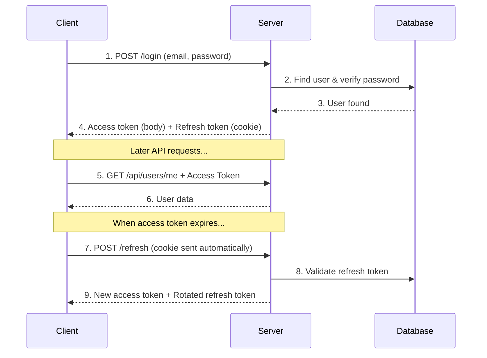
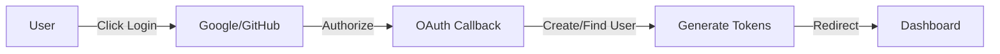

# 🚀 Create MERN Pro

A powerful CLI tool to scaffold **production-ready MERN stack applications** with TypeScript, modern authentication, and best practices built-in.

[](https://www.npmjs.com/package/create-mern-pro)
[](https://github.com/YOUR_USERNAME/create-mern-pro/blob/main/LICENSE)

---

## ✨ Features

| Feature | Description |
|---------|-------------|
| 🔷 **TypeScript** | Full type safety across frontend and backend |
| 🔐 **JWT Authentication** | Access + Refresh token strategy with rotation |
| 🌐 **OAuth 2.0** | Google and GitHub login out of the box |
| 📧 **Email Verification** | Secure email verification flow |
| 🔑 **Password Reset** | Forgot password with email tokens |
| ⚡ **Vite** | Lightning-fast frontend build tool |
| 🎨 **Tailwind CSS v4** | Modern utility-first CSS with new CSS-first config |
| 🐻 **Zustand** | Lightweight state management |
| ✅ **Zod Validation** | Runtime type validation on both ends |
| 🛡️ **Security** | Helmet, CORS, rate limiting, HTTP-only cookies |
| 📱 **Responsive UI** | Mobile-first design with modern components |

---

## 📦 Quick Start

```bash
# Create a new project
npx create-mern-pro my-app

# Navigate to project
cd my-app

# Configure environment
cd backend && cp .env.example .env
# Edit .env with your MongoDB URI and secrets

# Start backend (terminal 1)
npm run dev

# Start frontend (terminal 2)
cd ../frontend && npm run dev
```

Open [http://localhost:5173](http://localhost:5173) 🎉

---

## 🛠️ CLI Options

```bash
npx create-mern-pro [project-name] [options]
```

| Option | Description |
|--------|-------------|
| `-y, --yes` | Skip all prompts, use defaults |
| `--npm` | Use npm as package manager |
| `--yarn` | Use yarn as package manager |
| `--pnpm` | Use pnpm as package manager |
| `--skip-install` | Skip dependency installation |

### Examples

```bash
# Interactive mode
npx create-mern-pro

# Quick setup with npm
npx create-mern-pro my-app --npm --yes

# Just scaffold, install later
npx create-mern-pro my-app --skip-install
```

---

## 🏗️ Generated Project Structure

```
my-app/
├── backend/                    # Express.js + TypeScript Backend
│   ├── src/
│   │   ├── config/
│   │   │   ├── db.config.ts          # MongoDB connection
│   │   │   ├── env.config.ts         # Environment validation (Zod)
│   │   │   ├── cookie.config.ts      # Cookie settings
│   │   │   └── passport.config.ts    # OAuth strategies
│   │   │
│   │   ├── controllers/
│   │   │   ├── auth.controller.ts    # Auth endpoints logic
│   │   │   └── user.controller.ts    # User CRUD logic
│   │   │
│   │   ├── middleware/
│   │   │   ├── auth.middleware.ts    # JWT verification
│   │   │   ├── authorize.middleware.ts   # Role-based access
│   │   │   ├── validate.middleware.ts    # Zod schema validation
│   │   │   ├── error.middleware.ts   # Global error handler
│   │   │   └── rateLimiter.middleware.ts # Rate limiting
│   │   │
│   │   ├── models/
│   │   │   ├── User.model.ts         # User schema + methods
│   │   │   └── RefreshToken.model.ts # Token storage
│   │   │
│   │   ├── routes/
│   │   │   ├── auth.routes.ts        # /api/auth/*
│   │   │   └── user.routes.ts        # /api/users/*
│   │   │
│   │   ├── schemas/
│   │   │   ├── auth.schema.ts        # Auth validation schemas
│   │   │   └── user.schema.ts        # User validation schemas
│   │   │
│   │   ├── services/
│   │   │   ├── token.service.ts      # JWT generation/verification
│   │   │   └── email.service.ts      # Email sending (Nodemailer)
│   │   │
│   │   ├── types/
│   │   │   ├── express.d.ts          # Express augmentation
│   │   │   ├── auth.types.ts         # Auth types
│   │   │   └── user.types.ts         # User types
│   │   │
│   │   ├── utils/
│   │   │   ├── ApiError.ts           # Custom error class
│   │   │   ├── ApiResponse.ts        # Standardized responses
│   │   │   └── asyncHandler.ts       # Async error wrapper
│   │   │
│   │   ├── app.ts                    # Express app setup
│   │   └── server.ts                 # Server entry point
│   │
│   ├── .env.example
│   ├── package.json
│   ├── tsconfig.json
│   └── eslint.config.js
│
├── frontend/                   # React + Vite + TypeScript Frontend
│   ├── src/
│   │   ├── components/
│   │   │   ├── ui/                   # Reusable UI components
│   │   │   │   ├── Button.tsx
│   │   │   │   ├── Input.tsx
│   │   │   │   ├── Card.tsx
│   │   │   │   ├── Modal.tsx
│   │   │   │   └── Loader.tsx
│   │   │   │
│   │   │   ├── layout/               # Layout components
│   │   │   │   ├── Header.tsx
│   │   │   │   ├── Footer.tsx
│   │   │   │   ├── Layout.tsx
│   │   │   │   └── AuthLayout.tsx
│   │   │   │
│   │   │   └── forms/                # Form components
│   │   │       ├── FormField.tsx
│   │   │       └── FormError.tsx
│   │   │
│   │   ├── pages/
│   │   │   ├── public/               # Public pages
│   │   │   │   ├── Home.tsx
│   │   │   │   ├── Login.tsx
│   │   │   │   ├── Signup.tsx
│   │   │   │   ├── ForgotPassword.tsx
│   │   │   │   └── ResetPassword.tsx
│   │   │   │
│   │   │   ├── protected/            # Auth-required pages
│   │   │   │   ├── Dashboard.tsx
│   │   │   │   └── Profile.tsx
│   │   │   │
│   │   │   └── auth/                 # Auth flow pages
│   │   │       ├── AuthCallback.tsx
│   │   │       └── VerifyEmail.tsx
│   │   │
│   │   ├── routes/
│   │   │   ├── Router.tsx            # Route configuration
│   │   │   └── ProtectedRoute.tsx    # Auth guard
│   │   │
│   │   ├── stores/
│   │   │   ├── authStore.ts          # Auth state (Zustand)
│   │   │   └── uiStore.ts            # UI state
│   │   │
│   │   ├── services/
│   │   │   ├── api.ts                # Axios instance + interceptors
│   │   │   └── auth.service.ts       # Auth API calls
│   │   │
│   │   ├── hooks/
│   │   │   └── useAuth.ts            # Auth hook
│   │   │
│   │   ├── schemas/                  # Zod validation
│   │   ├── types/                    # TypeScript types
│   │   ├── utils/                    # Helpers
│   │   │
│   │   ├── App.tsx
│   │   ├── main.tsx
│   │   └── index.css                 # Tailwind v4 config
│   │
│   ├── .env.example
│   ├── package.json
│   ├── vite.config.ts
│   ├── tsconfig.json
│   └── eslint.config.js
│
└── README.md
```

---

## 🔐 Authentication Architecture

### Token Strategy

| Token Type | Lifetime | Storage | Purpose |
|------------|----------|---------|---------|
| **Access Token** | 15 minutes | Memory (React state) | API authorization |
| **Refresh Token** | 7 days | HTTP-only cookie | Get new access tokens |

> 💡 **Why two tokens?** Access tokens are short-lived for security. Refresh tokens allow seamless re-authentication without requiring login.

### Auth Flow



### OAuth Flow



---

## 🗄️ Database Schema

### User Model

```typescript
{
  email: string           // Unique, required
  password?: string       // Hashed, optional for OAuth
  name: string           
  avatar?: string        
  role: 'user' | 'admin' | 'moderator'
  
  // Email verification
  isEmailVerified: boolean
  emailVerificationToken?: string
  emailVerificationExpiry?: Date
  
  // Password reset
  passwordResetToken?: string
  passwordResetExpiry?: Date
  
  // OAuth
  googleId?: string
  githubId?: string
  authProvider: 'local' | 'google' | 'github'
  
  lastLogin?: Date
  createdAt: Date
  updatedAt: Date
}
```

### Refresh Token Model

```typescript
{
  token: string           // Hashed token
  userId: ObjectId        // Reference to User
  userAgent?: string      // Browser/device info
  ipAddress?: string      
  expiresAt: Date        
  createdAt: Date
}
```

---

## 🔌 API Endpoints

### Authentication

| Method | Endpoint | Description | Auth |
|--------|----------|-------------|------|
| POST | `/api/auth/register` | Create account | ❌ |
| POST | `/api/auth/login` | Login | ❌ |
| POST | `/api/auth/logout` | Logout | ✅ |
| POST | `/api/auth/refresh` | Refresh tokens | 🍪 |
| GET | `/api/auth/me` | Get current user | ✅ |
| POST | `/api/auth/forgot-password` | Request reset | ❌ |
| POST | `/api/auth/reset-password/:token` | Reset password | ❌ |
| GET | `/api/auth/verify-email/:token` | Verify email | ❌ |
| GET | `/api/auth/google` | Google OAuth | ❌ |
| GET | `/api/auth/github` | GitHub OAuth | ❌ |

### Users

| Method | Endpoint | Description | Auth |
|--------|----------|-------------|------|
| GET | `/api/users/me` | Get profile | ✅ |
| PUT | `/api/users/me` | Update profile | ✅ |
| PUT | `/api/users/me/password` | Change password | ✅ |
| DELETE | `/api/users/me` | Delete account | ✅ |

---

## 🛡️ Security Features

- ✅ **Password Hashing** - bcrypt with salt rounds
- ✅ **HTTP-only Cookies** - Refresh tokens protected from XSS
- ✅ **CORS** - Configured for frontend origin
- ✅ **Helmet** - Security headers
- ✅ **Rate Limiting** - Per-route limits
- ✅ **Input Validation** - Zod schemas
- ✅ **Token Rotation** - Refresh tokens rotated on use
- ✅ **Secure Token Storage** - Hashed in database

---

## 🎨 Frontend Tech Stack

| Technology | Version | Purpose |
|------------|---------|---------|
| React | 19.x | UI Framework |
| Vite | 7.x | Build Tool |
| TypeScript | 5.9 | Type Safety |
| Tailwind CSS | 4.x | Styling |
| Zustand | 5.x | State Management |
| React Router | 7.x | Routing |
| React Hook Form | 7.x | Form Handling |
| Zod | 3.x | Validation |
| Axios | 1.x | HTTP Client |
| Lucide React | 0.5x | Icons |

---

## ⚙️ Backend Tech Stack

| Technology | Version | Purpose |
|------------|---------|---------|
| Express | 5.x | Web Framework |
| TypeScript | 5.9 | Type Safety |
| Mongoose | 9.x | MongoDB ODM |
| Passport | 0.7 | Authentication |
| Zod | 3.x | Validation |
| JWT | 9.x | Token Auth |
| Nodemailer | 7.x | Email |
| Helmet | 8.x | Security |

---

## 🔧 Environment Variables

### Backend (.env)

```env
# Server
NODE_ENV=development
PORT=5000

# MongoDB
MONGODB_URI=mongodb://localhost:27017/myapp

# JWT
ACCESS_TOKEN_SECRET=your-secret-min-32-chars
REFRESH_TOKEN_SECRET=your-secret-min-32-chars
ACCESS_TOKEN_EXPIRY=15m
REFRESH_TOKEN_EXPIRY=7d

# Cookie
COOKIE_SECRET=your-cookie-secret

# CORS
CLIENT_URL=http://localhost:5173

# Email (optional)
SMTP_HOST=smtp.gmail.com
SMTP_PORT=587
SMTP_USER=your-email@gmail.com
SMTP_PASS=your-app-password

# OAuth (optional)
GOOGLE_CLIENT_ID=your-google-client-id
GOOGLE_CLIENT_SECRET=your-google-client-secret
GITHUB_CLIENT_ID=your-github-client-id
GITHUB_CLIENT_SECRET=your-github-client-secret
```

### Frontend (.env)

```env
VITE_API_URL=http://localhost:5000/api
```

---

## 📋 Requirements

- **Node.js** >= 20.0.0
- **MongoDB** (local or Atlas)
- **npm/yarn/pnpm**

---

## 🤝 Contributing

Contributions welcome! Please read our contributing guidelines.

---

## 📄 License

MIT © 2026

---

<p align="center">
  Made with ❤️ for the MERN community
</p>
